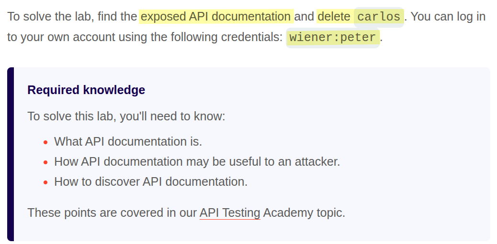
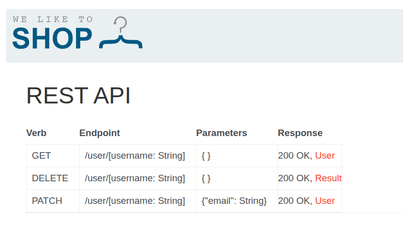

# Portswigger Web Security Academy | API Testing Lab #1

Hi all! Today we’ll be solving the first API Testing lab of the PortSwigger Web Security Academy. Let’s get started!

### Lab Description



Just by reading the description, we can assume that we’ll probably see API documentation if we find the right path for it. If this is your first time hearing the word “documentation,” it’s a document that helps developers index an API, understand API use cases, inputs, outputs, etc.

Here’s the most popular third-party solution for creating API documentation: [https://editor.swagger.io/](https://editor.swagger.io) 

You can also find other exposed Swagger API documentation using the following Google dork:

```bash
inurl:"swagger-ui/index.html"
```

Normally, this is sensitive document, meaning it should only be published internally to developers, DevOps engineers, project managers, etc. However, sometimes people forget to put proper access controls on these sensitive files. Or they think putting an unpredictable path like `/ade00aa1afbd22345e757bccbf0ac6c5/documentation` is secure enough. But they often forget about Google indexing, Web Archive, Shodan bots, and so on.

Alright, let’s try a couple of possible paths to see if we can actually access an API documentation page:

```
/docs
/openapi.json
/openapi.yaml
/swagger
/swagger-ui
/swagger.json
/redoc
/api/docs
/api/swagger
/api/redoc
/api
/api/v1
/api/v1/docs
/api/v1/swagger
/api/v1/redoc
/v1/docs
/v1/swagger
```



It turns out `/api` is the path we were looking for. The goal is to remove the `carlos` user, so let's try making a **DELETE** request to the endpoint listed here to see if we can remove it even though we're not an admin user. If we can do it, it indicates an access control vulnerability.

```bash
curl -X DELETE "https://0a2800c0049d4b4f80526c8e0072001a.web-security-academy.net/api/user/carlos" \ 
     -b "session=Qu4HSCLHGhjkLvWEvJDGJaPOV7yDrp3X" \
     -i
```

Make sure to update the session cookie value and the lab subdomain based on your initiated lab data. To get the cookie value, open the Network tab of your browser, go to the request headers, and find the `Cookie` header.

After sending the request, I saw the following response:

```json
{"status":"User deleted"}
```

Then I saw the “Lab Solved” banner in the header. That’s all for this lab. Thanks for reading, and have a nice day!