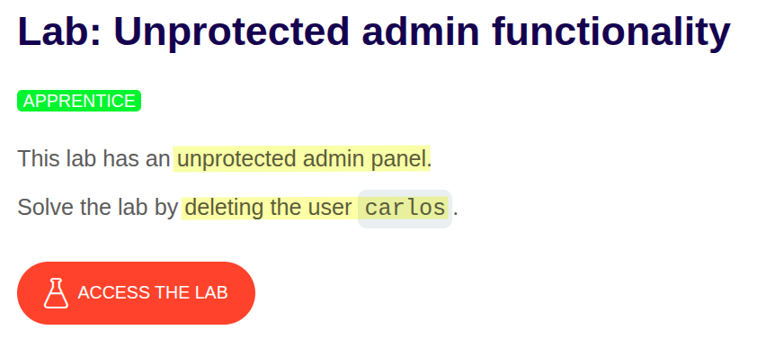
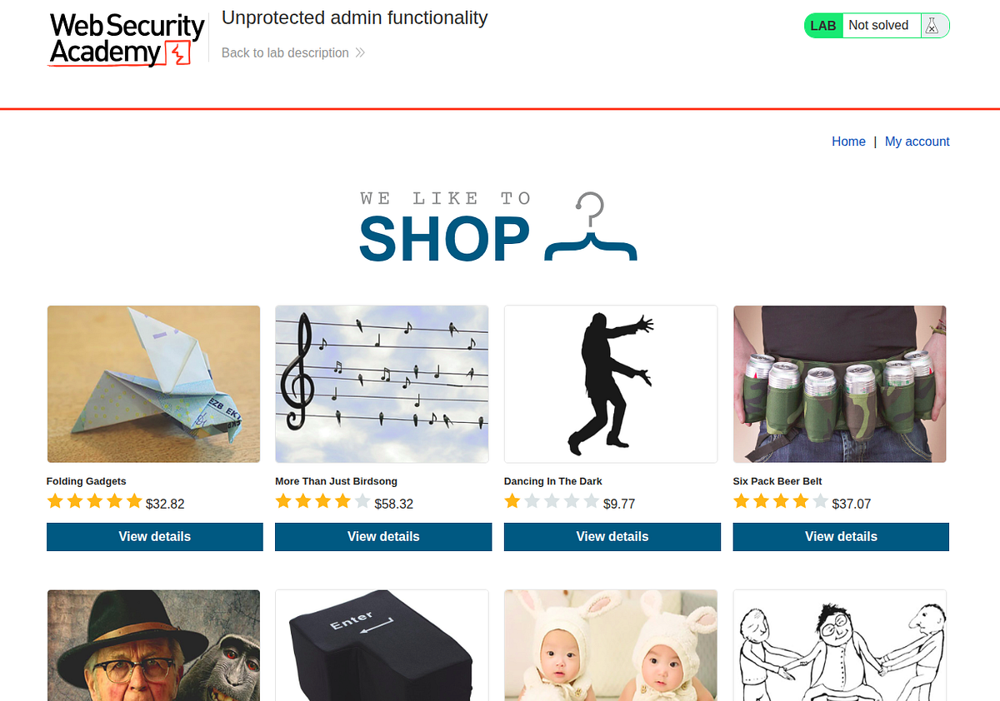
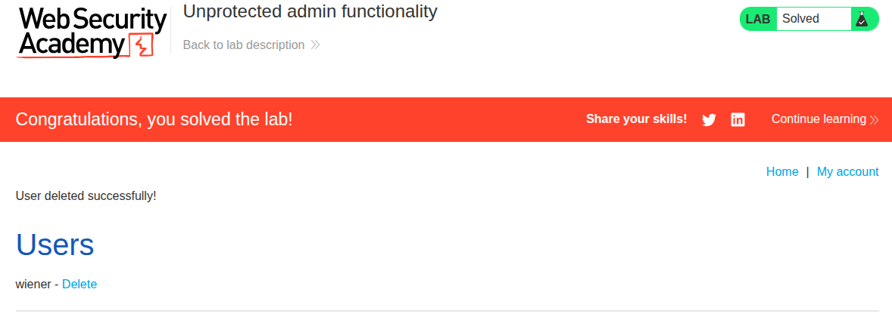

# Portswigger Web Security Academy | Access Control Lab #1

Hi all! Today we’ll be solving the first Access Control lab of the Portswigger Web Security Academy. Let’s see the lab description and start solving the lab!

---

#### **Lab Description**



OK, let’s dive into the lab and see what we have to access to the unprotected admin panel. This is what the homepage looked like when I initiated the lab:



As this is the first lab, I thought the solution would be in an HTML comment like this one:

```html
<div>
<!-- you can log in to the admin panel from /admin, 
TODO: this page needs a proper access control -->
</div>
```

But it wasn’t the case actually; I searched for such a comment in all posts, user details, the homepage, the cart page, etc.; however, I couldn’t find any lead like that. After thinking a little, I found the solution, and it was the **robots.txt**.

If it was your first time seeing robots.txt. It’s a file that you can configure to tell search engine bots which pages in your site should be indexed and which ones should be omitted. It’s very useful if you’re building an admin dashboard, a private instance, or any application that’s open to the internet yet shouldn’t be found by just a Google search.

Let me show you how it works first. This is the robots.txt of Airbnb:

```
User-agent: Googlebot
Allow: /calendar/ical/
Allow: /.well-known/amphtml/apikey.pub
Disallow: /.well-known/assetlinks.json
Disallow: /*/skeleton
Disallow: /*/sw_skeleton
Disallow: /500
Disallow: /account
Disallow: /alumni
Disallow: /api/v1/trebuchet
```

**Allow** means that I want the specified search engine to index this page for my website, and as you can guess, **Disallow** does the exact opposite.

What’s neat about robots.txt is they’re always located at the root of the domain. For example, in order to access the robots.txt of Airbnb, you can go to [https://www.airbnb.com/robots.txt](https://www.airbnb.com/robots.txt).

Anyway, in our case, if you go to the /robots.txt path, you’ll see such an output:

```
User-agent: *
Disallow: /administrator-panel
```

This is the non-protected admin panel that the description mentioned. Let’s go to the panel and remove the carlos user to complete the lab.



Thanks for reading, have a nice day!