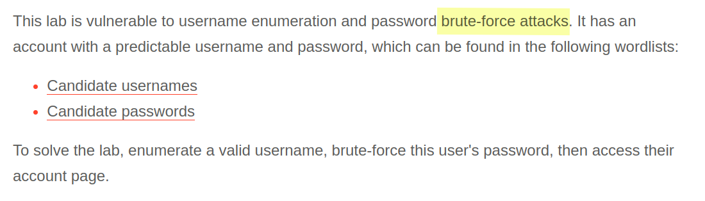
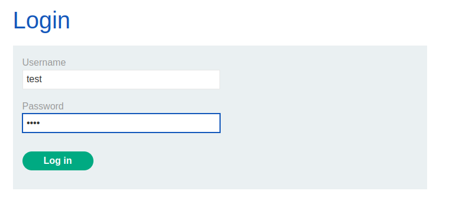
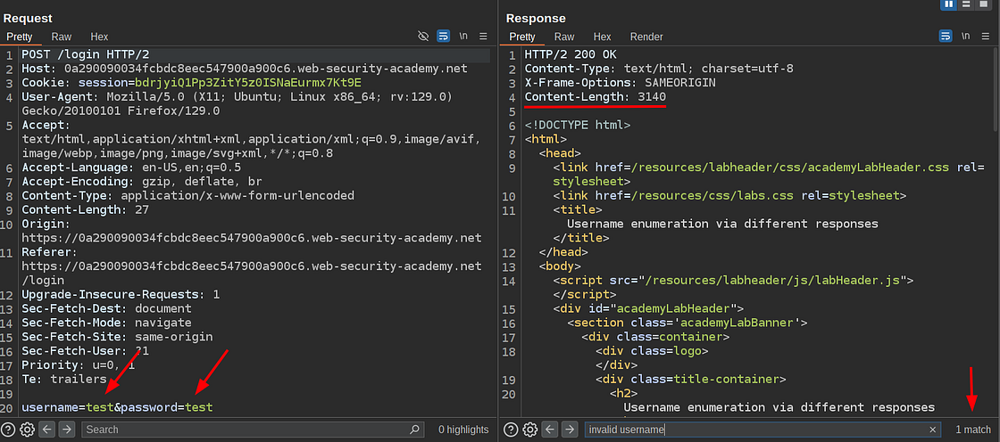
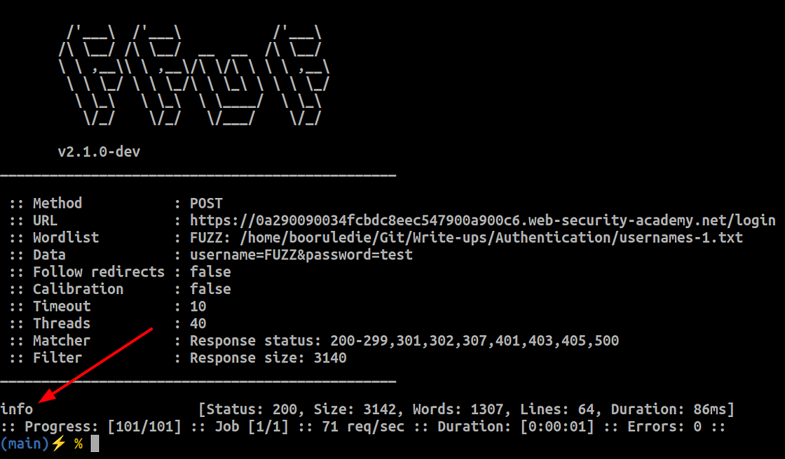
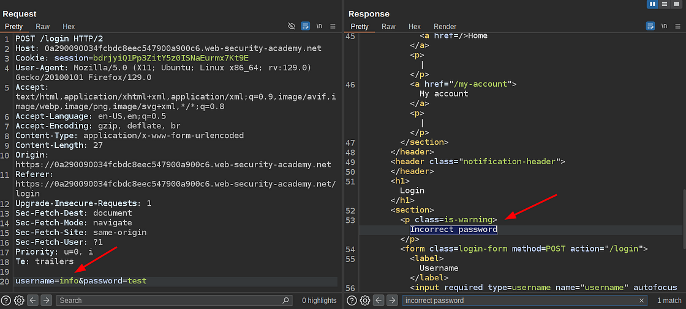
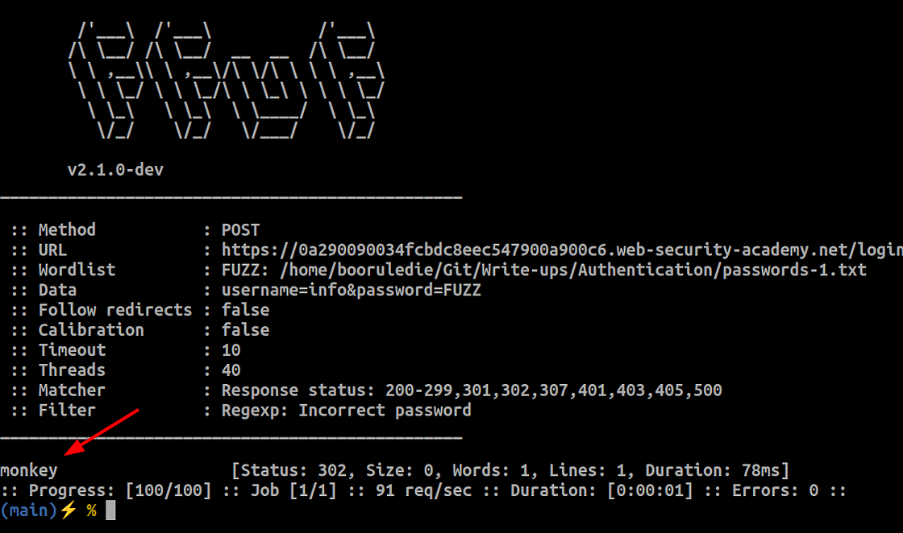
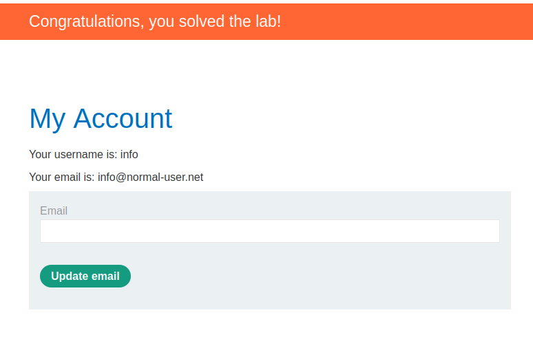

# Portswigger Web Security Academy | Authentication Lab #1

Hi all! Today we'll be solving the first authentication lab of the Portswigger Web Security Academy. Let's see the lab description and start solving the lab!

---

### Lab Description



As you can tell, we're just going to download the username and password wordlist and perform a simple brute force attack on a login page. It's quite simple. Let's see the login page and the request that's being made by the application first.

This is the login page:



And this is the request that's made:



As you can see, we got such a message in the response body: **`invalid username`**.

Let's brute force just the usernames and see if we'll get a different message in the response body. I'll use **ffuf**, but you can use any brute force you'd like. Here's the ffuf command to brute force just the username parameter:

```bash
ffuf -u "https://0a290090034fcbdc8eec547900a900c6.web-security-academy.net/login" \
     -X POST \
     -d "username=FUZZ&password=test" \
     -w ./usernames-1.txt \
     -fs 3140
```

- **`-u`**: URL
- **`-X`**: HTTP Method
- **`-d`**: Form Parameter *(the FUZZ keyword allows fuzz the parameter, the other parameter has a fixed value which is 'test')*
- **`-w`**: Wordlist
- **`-fs`**: Filter by **Content-Length** value in the HTTP response. This flag causes ffuf to return only HTTP responses that have a different content length than **3140**.

Here's the result:



The **info** value for the username returned a different Content-Length in the response. Let's make the request on the browser and see what it returns.



It returned **"incorrect password"!** It means there is a user with the username **`info`** in the database but the password is incorrect, so we can just do the same with password wordlist using the **`info`** username and hopefully we can login to the account. Here's the new ffuf command:

```bash
ffuf -u "https://0a290090034fcbdc8eec547900a900c6.web-security-academy.net/login" \
     -X POST \
     -d "username=info&password=FUZZ" \
     -w ./passwords-1.txt \
     -fr "Incorrect password"
```

Only different parts are the new wordlist, which is the password wordlist, and the filter parameter. This time instead of filtering the content length. I've used the `-fr` that allows filtering by regular expressions. In simple words, it'll return the HTTP responses that do not have specified regex value in the HTTP response body. This is the result we got:



I guess now we have the credentials as follows:
* **username**: **`info`**
* **password**: **`monkey`**

Let's test the credentials on the application:



Apparently they're right! Thanks for reading, have a nice day!