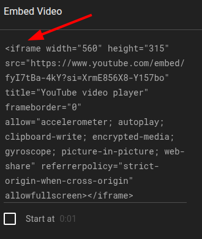
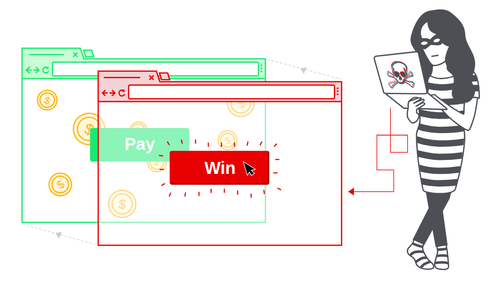
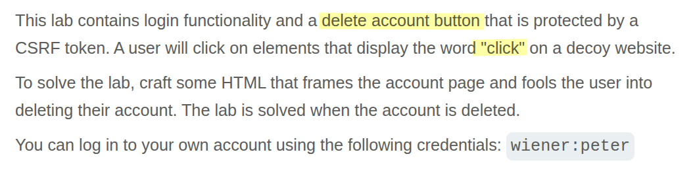
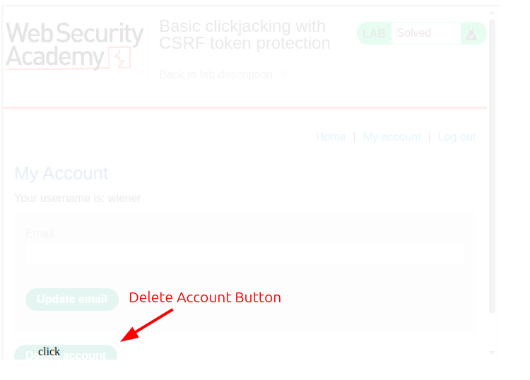

# Portswigger Web Security Academy | Clickjacking Lab #1

Hi everyone — today we’ll solve the first **Clickjacking** lab from the PortSwigger Web Security Academy. Let’s get started!

### What’s Clickjacking ?

To understand clickjacking, first we need to know what an `<iframe>` element is. An `<iframe>` lets you embed one website inside another. This is how Google Maps, YouTube videos, and similar services are commonly embedded on legitimate sites. If you want users to watch a video or view a map without leaving your site, you hit the _share_ button, choose _embed_, and paste the provided code into your page. That embed is usually an `<iframe>` that loads content from another origin while still appearing inside your page.



Clickjacking abuses this tag to trick users. An attacker embeds the target site in an `<iframe>` on a page they control, then reduces the iframe’s opacity so its content becomes invisible. They modify their own page so that when users click visual elements on the attacker’s page, they’re actually clicking corresponding controls in the invisible iframe (for example, a “Delete account” button on the victim site). The user believes they’re interacting with the attacker’s page, but in reality they’re interacting with the target site inside the iframe.

Attackers often rely on the CSS `z-index` property to ensure the invisible iframe sits above the attacker’s visible elements, so clicks are forwarded to the target site. The attack typically follows these steps:

1.  Embed the target website using an <iframe> on an attacker-controlled page.
2.  Adjust the attacker page so visible elements line up with the interactive elements inside the iframe.
3.  Set the iframe’s z-index higher than the attacker’s visible elements so the iframe receives clicks.
4.  Lower the iframe’s opacity (for example, near zero) so it appears invisible to the user.

And that’s the essence of clickjacking. Here’s an illustration from PortSwigger to make it clearer — take a look, then start solving the lab!



[https://portswigger.net/web-security/clickjacking](https://medium.com/r/?url=https%3A%2F%2Fportswigger.net%2Fweb-security%2Fclickjacking)

### Lab Desc



This lab is straightforward: create HTML that aligns an iframe over the target site’s **Delete account** button and cause a simulated user to click it. You’ll need some CSS to position elements; the rest is trial and error until alignment is correct.

Here’s an example HTML snippet (the iframe is given very low opacity so it’s mostly invisible):

```html
<style>
    iframe {
        position:relative;
        width:700px;
        height: 500px;
        opacity: 0.1;
        z-index: 2;
    }
    div {
        position:absolute;
        top:490px;
        left:60px;
        z-index: 1;
    }
</style>
<div>click</div>
<iframe src="https://0a1a00700304e6248073490000740044.web-security-academy.net/my-account"></iframe>
```



Adjust the `top` and `left` values (and the iframe size) until the visible “click” area lines up with the Delete button inside the iframe.

That’s all for this lab — thanks for reading, and good luck!