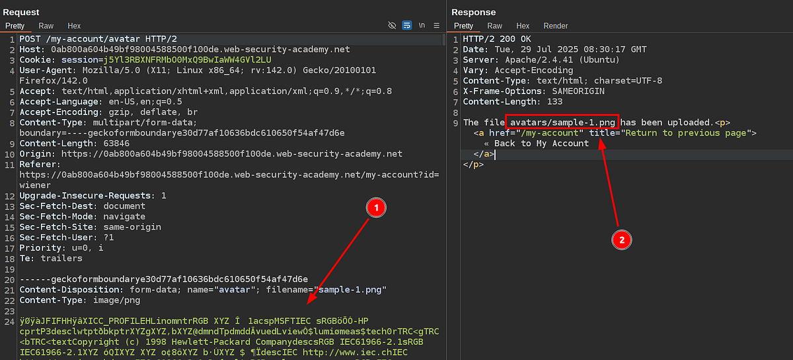
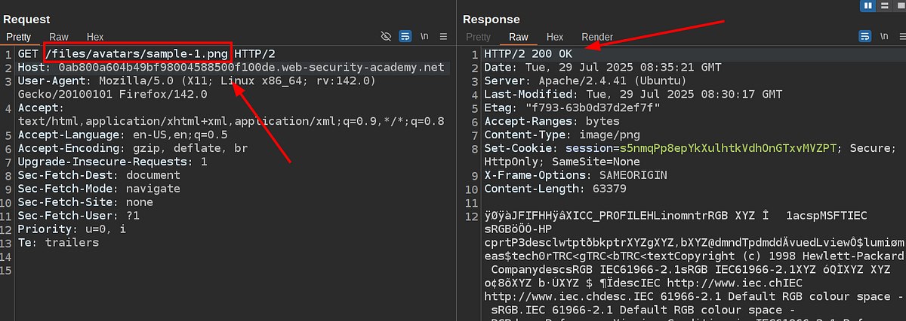

# Portswigger Web Security Academy | File Upload Lab #1

Hi all! Today we’ll be solving the first File Upload Vulnerabilities lab of the Portswigger Web Security Academy. Let’s see the lab description and start solving the lab!

---

#### **Lab Description**


OK, the description is quite informational; let’s open the app and check the file upload feature from Burp Suite.



After logging in as the winner user, I picked a dummy image and uploaded it via the upload feature in the profile page. This is how the request of that file upload action looks. The first red arrow shows the file data, and the second one shows the uploaded name. Sometimes uploaded files’ names and paths can be changed, so let’s go back to home and let the page fetch the uploaded file so we can deduce the URL.



As you can see, the filename and path don’t change; only the app appends a /files prefix to the URL.

Alright, everything seems ready to test. Let’s create a test PHP file, upload it, and then trigger the uploaded PHP to see if we can really upload any file type and execute the PHP on the server by accessing the uploaded PHP file. This is the PHP content that I’ll use:

```php
<?php
$passwd_content = file_get_contents('/etc/passwd');
echo $passwd_content;
?>
```

This file gets the content of all users on the Linux server. Let’s upload it and try to access it as I’ve just shown above:


As you can see, we can both upload and execute PHP scripts to the server via this file upload feature. Now, let’s create the PHP script that’ll read Carlos’s secret file’s content by just changing the function’s argument:

```php
<?php
$carlos_secret = file_get_contents('/home/carlos/secret');
echo $carlos_secret;
?>
```

This should be fine; let’s try to read the content and submit it.


After I’ve submitted it, the secret is accepted and the lab is completed. Thanks for reading; have a nice day!