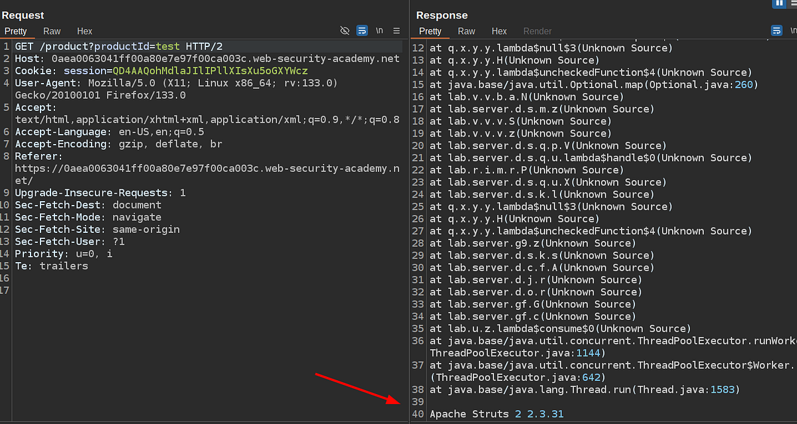

# Portswigger Web Security Academy | Information Disclosure Lab #1

Hi all! Today we'll be solving the first information disclosure lab from Portswigger Web Security Academy. Let's see the lab description and start solving the lab!

---

### Lab Description


Alright, so what we need to do is look for error messages in the application. And if we manage to find any version number in those error messages, we can search it in the exploit database to see if the version we got is vulnerable or not.

The application doesn’t have much functionality. There is just the homepage, which is a list view of products. And also there is a product detail page. I couldn’t find anything to play with in the homepage’s request, so let’s inspect in more detail the product detail HTTP request:


The first thing that came to mind was removing the value and resending the request. But apparently the application can handle it and doesn’t return any verbose error message with a version number inside:


After that I’ve tried:

-   Make a GET request to an invalid endpoint
-   Change HTTP request method
-   Make a GET request to `/product` endpoint with an invalid parameter
-   Make a GET request to `/product` endpoint with string value instead of integer

And last one succeeded:

```
<span>GET /product?productId= -&gt; <span>"Missing parameter: productId"</span><br>GET /some-invalid-endpoint HTTP/2 -&gt; <span>"Not Found"</span><br>POST /product?productId= -&gt; <span>"Method Not Allowed"</span><br>GET /product?invalidParameter= -&gt; <span>"Missing parameter: productId"</span><br>GET /product?productId=<span>test</span>= -&gt; Verbose Error Message 😈</span><p>Auto (Bash)<span></span></p>
```



The vulnerable 3rd party service looks like Apache Struts with the version of `2.3.31`. Let’s check if that version has any known vulnerability. In order to do that we can use the [exploit-db](https://medium.com/r/?url=https%3A%2F%2Fwww.exploit-db.com%2F).


Yes, this version is vulnerable to Arbitrary Code Execution. In order to solve the lab we just need to submit the version number to the lab and it’s done.

Thanks for reading, have a nice day!