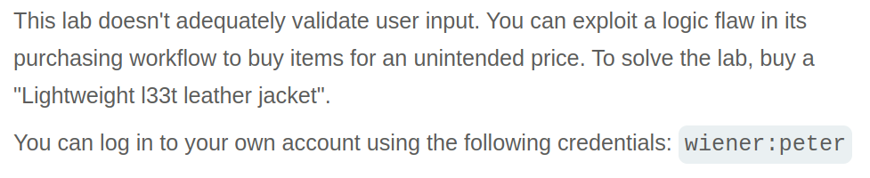
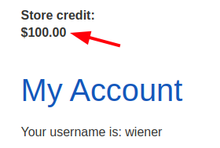
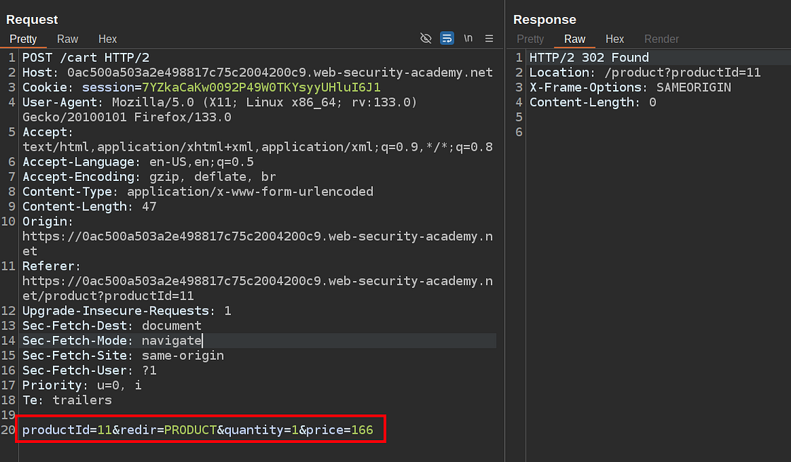
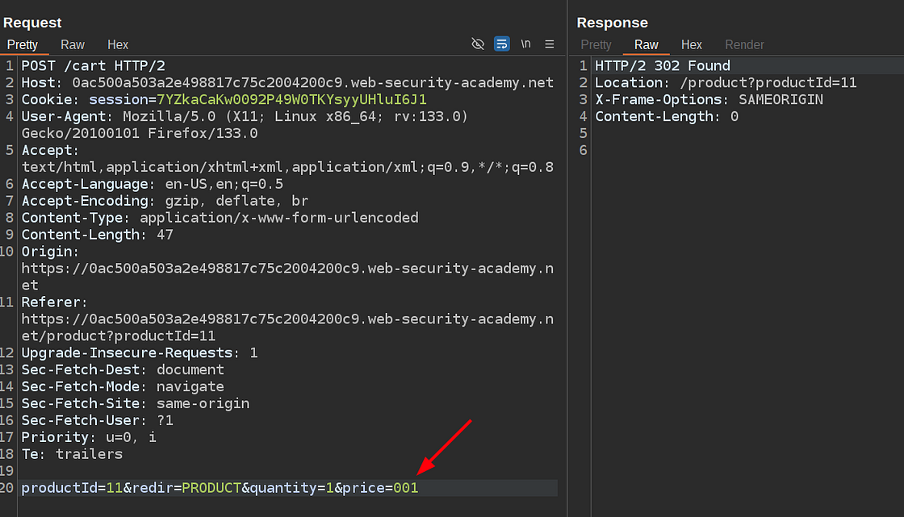
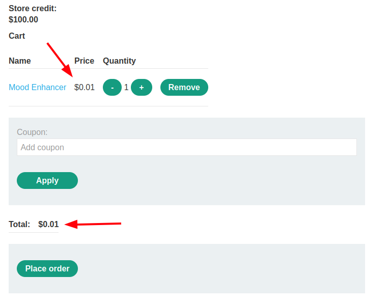
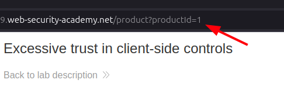

# Portswigger Web Security Academy | Logic Flaws Lab #1

Hi all! Today we'll be solving the first Logic Flaw lab of the Portswigger Web Security Academy. Let's see the lab description and start solving the lab!

---

## Lab Description

Looks like it's going to be an easy one. Let's login as wiener and start inspecting the application.

I've logged in as wiener user and apparently this user has $100 in his account. Let's add a product to our cart and inspect the request that's made in more detail. After I hit the "Add to cart" button in the product detail page such a request is made by the application:

As you can see, the price of the product is sent as well, which is weird because what happens commonly is that you only see some type of product id here, and the rest of the data retrieval, like price, product description, product title, e.g., is made on the backend side. Let's tamper with it and resend the request and see what'll happen.

I've changed the price to 001 which is 1 cent and it added the same product to my cart with the price of 1 cent!

So, this is what the description was talking about. In frontend, you can't perform such a request, but if you're using a proxy tool just like Burp Suite, you can capture the request, change the values as you'd like, and resend it with the changed data. Alright, so we've found the logic flaw vulnerability in this application.

What we need to do now is solve the lab; in order to do that, as the description stated, we need to buy the **"Lightweight "l33t" Leather Jacket"**.

In my case, the `productId` of the product is `1`, so I'll just use the same request I've captured and change the `productId` field to `1`, but if it's different in your case, you can see the id of the products from the URL bar. Just go to any product detail page and look at the URL bar.

After I've made the change and sent the request, the **"Lightweight "l33t" Leather Jacket"** added to my cart with the price of 1 cent.

After I've placed the order, I've managed to buy the mentioned product for 1 cent, and the lab is solved!

Thanks for reading; have a nice day!