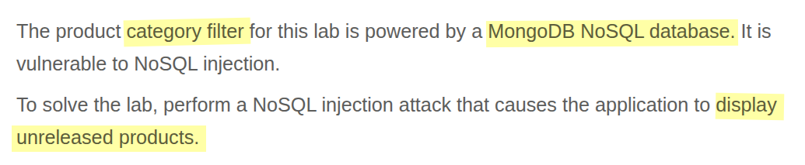
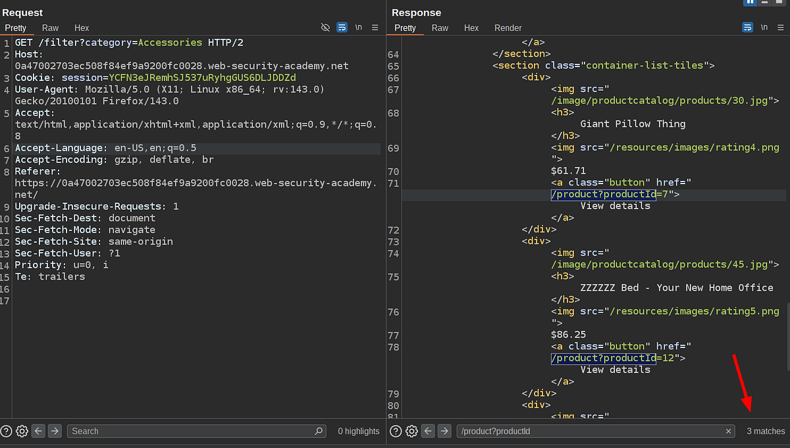
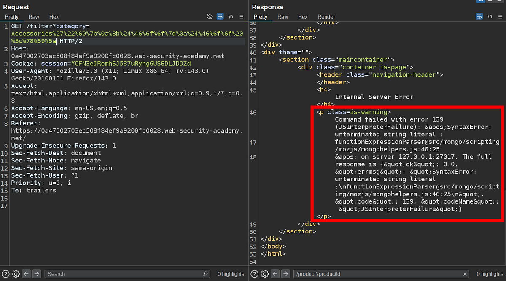

# Portswigger Web Security Academy | NoSQL injection Lab #1

Hi all! Today, we’ll be solving the first **NoSQL Injection** lab from the PortSwigger Web Security Academy. Let’s get started!

NoSQL injection is somewhat similar to the SQL Injection vulnerability. The issue occurs when user input is not properly parameterized, allowing an attacker to inject their own payload and make the application execute unintended queries — just like in SQL injection.

One of the biggest differences is the syntax. Relational databases are the most commonly used, so SQL syntax is familiar to most people, making it easier to craft SQLi payloads or understand their purpose. Unfortunately, this is not the case with NoSQL Injection. There are various NoSQL databases like MongoDB, CouchDB, Neo4j, Cassandra… and each has its own query language, quite different from SQL.

Understanding these differences is very important when testing for NoSQL injection vulnerabilities in applications. Now let’s look at the lab description and start solving it.

### Lab Description



The lab provides plenty of useful information before we even examine the HTTP requests. The vulnerability exists in the category filter feature, and the app uses MongoDB as its NoSQL database. Our goal is to exploit the NoSQL vulnerability to retrieve unreleased products.

Here’s the HTTP request described in the lab:



Based on the request, we know that there are three products in the Accessories category. We can use this information during exploitation to verify whether our attack is successful.

Next, let’s try breaking the syntax of the NoSQL query on the backend to detect the vulnerability. PortSwigger recommends the following payload:

```
'"`{
;$Foo}
$Foo \xYZ
```

This payload is effective because it contains almost all characters that could break the syntax of a NoSQL query. We can URL-encode it and send the tampered HTTP request.



As you can see, we successfully broke the syntax with the payload. After this point, all you need to do is find the exact character that broke the syntax and then start crafting your payload. In this case, the right character was `'`, which is familiar because it can also cause SQL injection.

After trying a few payloads, I found that I could retrieve all the products using the following payload:

```
' || 'a'==='a
```

Based on the information we have, the vulnerable backend probably looks like this:

```ts
app.get("/filter", async (req: Request, res: Response) => {
    try {
      const { category } = req.query;

      // ❌ BAD: directly using user input inside $where
      // MongoDB will interpret this as JavaScript code
      const results = await categories
        .find({
          $where: `this.name == '${category}'`
        })
        .toArray();

      res.json(results);
    } catch (err) {
      console.error(err);
      // Warning: exposing raw error to client (insecure)
      res.status(500).send(`<pre>${err}</pre>`);
    }
  });
```

Here’s the correct way to implement this endpoint, preventing NoSQL injection:

```ts
app.get("/filter", async (req: Request, res: Response) => {
    try {
      const { category } = req.query;

      // Validate input
      if (typeof category !== "string" || category.trim() === "") {
        return res.status(400).render("error", { message: "Invalid category" });
      }

      // Use structured query object, no $where
      const results = await categories
        .find({ name: category })
        .toArray();

      res.render("categories", { categories: results });
    } catch (err) {
      // Log full error on server
      console.error("Server Error:", err);

      // Send generic error to client (safe)
      res.status(500).render("error", { message: "Something went wrong. Please try again later." });
    }
  });
```

That’s all for this lab. Thanks for reading, and have a nice day!