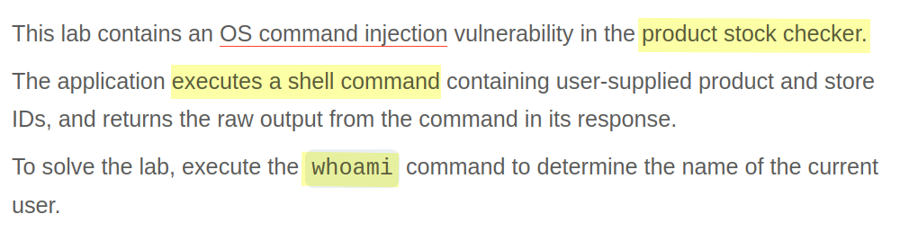
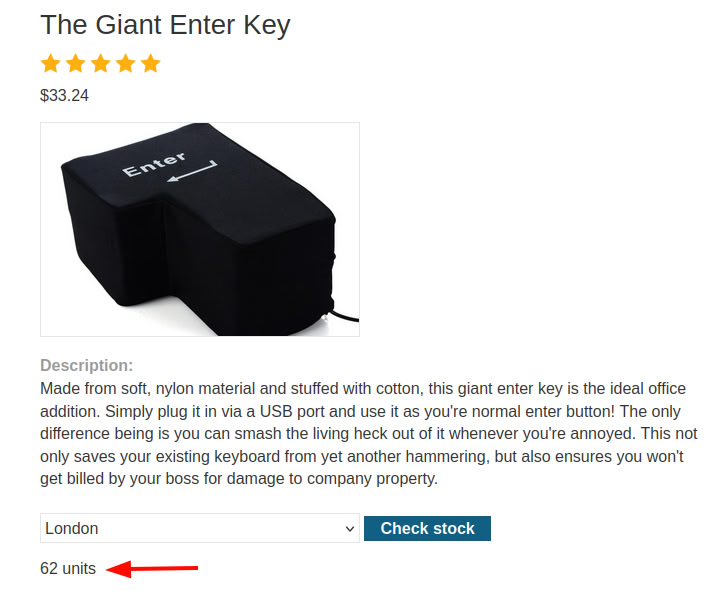
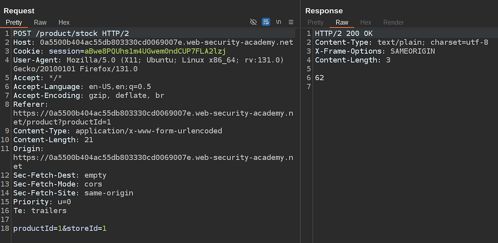
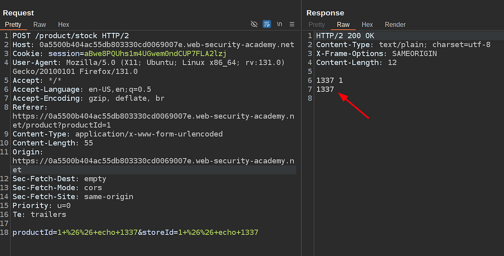
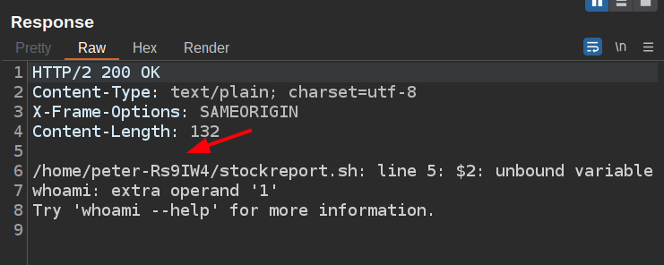

# Portswigger Web Security Academy | OS Command Injection Lab #1

Hi all! Today we'll be solving the first OS command injection lab of the Portswigger Web Security Academy. Let's see the lab description and start solving the lab!

---

### Lab Description



Based on the lab description, I assume the app works like this:

First, you give some type of value to the web application about the product to get stock information.

```http
GET /get-product-stock?product_id=123 HTTP/2
```

Then the app executes a server-side script to get the value to be returned with the specified user input.

```http
python3 get_stocks.py 123 # 123 comes from user input
```

Well, if the application works that way and if user input is not handled properly, then you can specify some command separator character like `&&` and start executing your own commands on the web application server, which is one of the most critical vulnerabilities in the web application security.

Let's see how application stock retrieval functionality works. In order to do that first, we need to go to a product detail page.



Alright, after you specify the location and hit the check stock button application makes such a request and writes response directly to the HTML as the remaining stock quantity:



It's a POST request and there are two parameters in the body. In order to see which one is vulnerable I decided to use such a payload:

```bash
# original
productId=1&storeId=1

# payload
productId=1 && echo 1337&storeId=1 && echo 1337

# URL encoded payload
productId=1+%26%26+echo+1337&storeId=1+%26%26+echo+1337
```

It's important to URL encode the payload before sending it as it can break the syntax. Now let's send the request and see the response:



Apparently both of the parameters are vulnerable to OS Command Injection. The lab description asked us to execute the `whoami` command so we just need to adjust the payload a little and send it.

```bash
# original
productId=1&storeId=1

# payload
productId=1 && whoami&storeId=1

# URL encoded payload
productId=1+%26%26+whoami&storeId=1
```

Here's the result:



As you can see, the command that's executed on the backend side is broken as we tried to execute another command with our payload. And now we see some other data, like the name of the user on the server or the name of the script, which is `stockreport.sh`.

This is the end of the lab and this write-up. Thanks for reading; have a nice day!