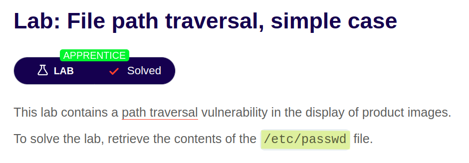
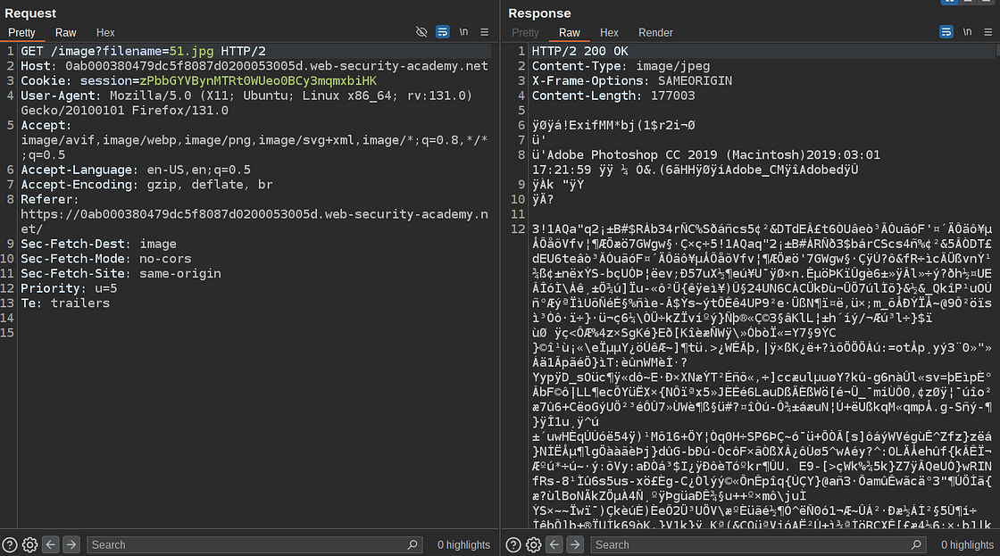
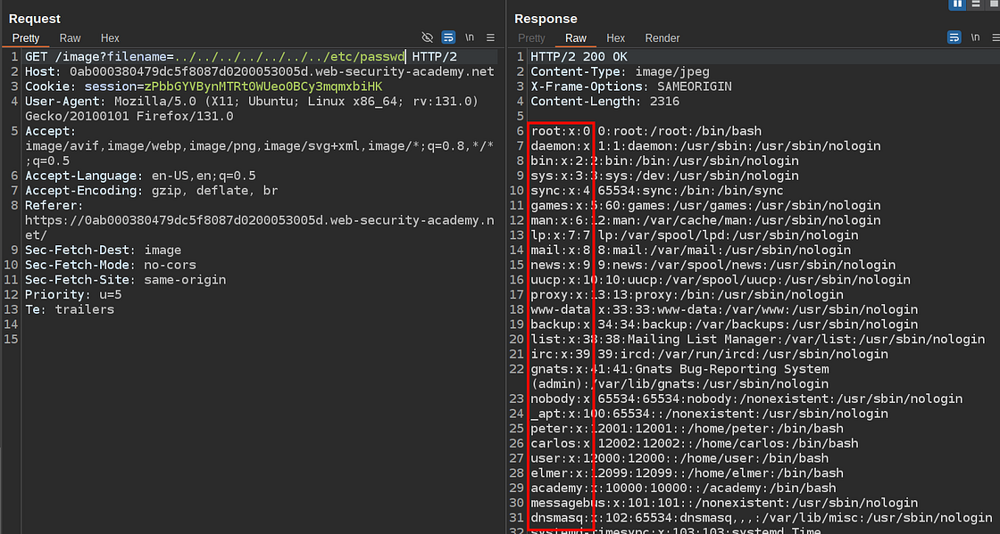

# Portswigger Web Security Academy | Path Traversal Lab #1

Hi all! Today we'll be solving the first path traversal lab from Portswigger Web Security Academy. Let's see the lab description and start solving the lab!

---

### Lab Description



The description says that the app is vulnerable to path / directory traversal vulnerability in the image display functionality. And our goal is to get the contents of the `etc/passwd` file, which contains some data *(including hashed passwords)* about all users in a Linux system.

Before diving to the lab directly, let me briefly explain what the path traversal is, and then we can proceed to the lab.

Path Traversal or Directory Traversal is a vulnerability that allows an attacker to access arbitrary files in the server that are not supposed to be accessed most of the time just like `/etc/passwd` file on Linux systems.

Think about an img element in any HTML document.

```html

```

This image element causes such a GET request to the server to fetch the image:

```http
GET /?file=some-file-name.png HTTP/2
Host: server-hostname
```

And if the server doesn't have any type of protection against path traversal and all images are stored on the same server, you can just simply change the file parameter's value to a path and get the file content just like this:

```http
GET /?file=../../../../../../../../etc/passwd HTTP/2
Host: server-hostname
```

As you can see I'm trying to get to the root directory and read the contents of the `/etc/passwd`.

That's what path traversal is. Now let's get back to lab and solve it!

If you inspect any image HTTP request you'll see a similar structure to the one I mentioned above:



Now what I'll do is change `51.jpg` to `../../../../../../../etc/passwd` and resend the request. Let's see what'll happen.



We managed to read the contents of `/etc/passwd` file. Red rectangle shows some of the usernames in the server.

Thanks for reading, have a nice day!