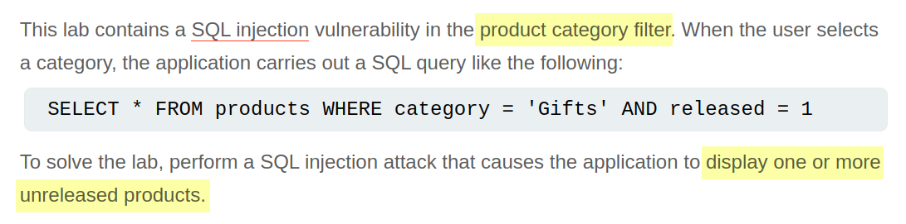
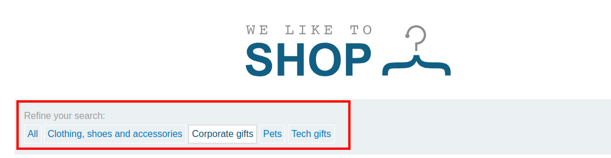
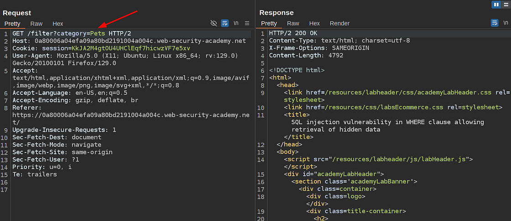
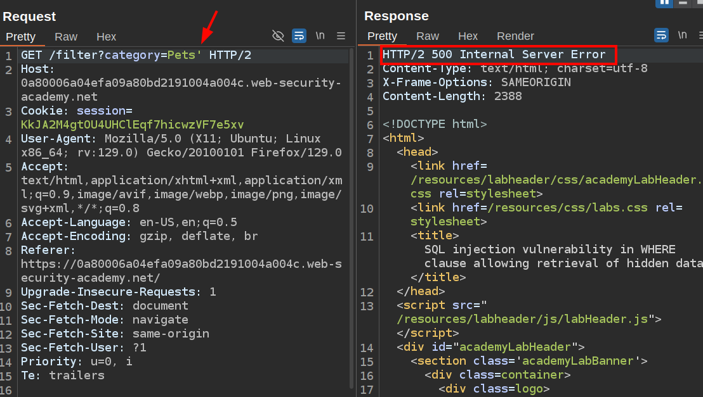
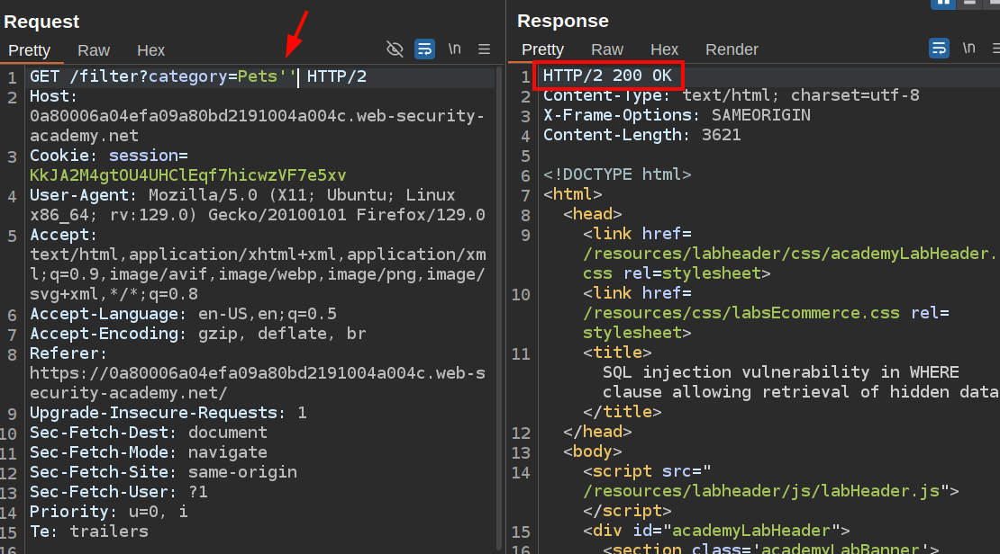
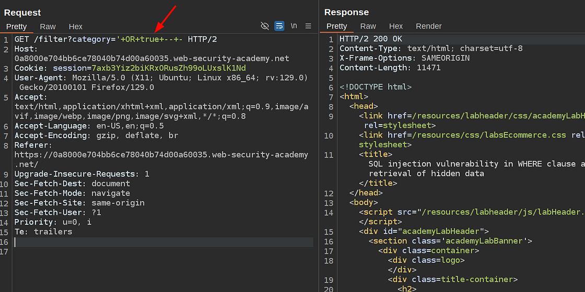
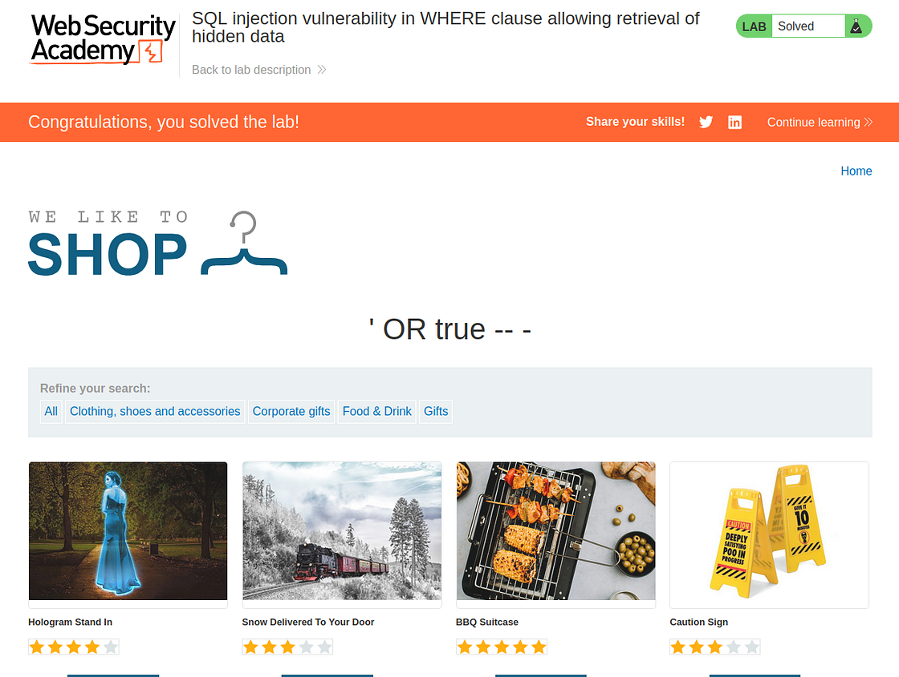

# Portswigger Web Security Academy | SQLi Lab #1

Hi all once again! It's been a very long time since the last time I've posted a security write-up here. I've decided to start over, complete all Portswigger Web Security Academy Labs and lastly share how I solved the labs. Let's start with the first one!

---

## Lab Description



As you can see from the screenshot, we know where the SQLi vulnerable part will be in the application. It's the category filter part. In order to solve the lab we need to get at least one unreleased product. And we have the SQL that's being executed by the application as well.

Let's dive in to the lab and see how the app functions together.



This is the category filter feature of the application. When any of the categories is selected, such a request is made by the application:



We know that the application is vulnerable at this feature, and the only user input that is taken is the category, so I'm assuming that this category query parameter is vulnerable to SQL injection.

We can test by simply adding a single quote and sending the request again. If we get a 5xx status code in the response, it's a strong indicator that SQL is broken on the application side.

And lastly, we can add another single quote and send the request once again. If we get a 2xx response just like the image above, it can verify the SQL injection vulnerability because the second single quote will resolve broken SQL syntax, and the app would execute the SQL without any problem, just like the first time it's being executed.

Here's an example in SQL of what I explained above:

### First Request
```sql
SELECT * FROM products WHERE category = 'Gifts' AND released = 1; -- 200 OK
```

### Second Request
```sql
SELECT * FROM products WHERE category = 'Gifts'' AND released = 1; -- 500 Internal Server Error
```

As you can see the last single quote added to the category's value broke the SQL. That's why we expect to see 5xx status code.

### Third Request
```sql
SELECT * FROM products WHERE category = 'Gifts''' AND released = 1; -- 200 OK
```

Now the single quotes are closed properly by adding the other single quote to the payload, so the app should be able to execute the SQL without any problem.

Now let's test the payload on the application.





As you can see the behavior is exactly what we assumed.

At this point it's important to note that if the app didn't function as I explained above, it wouldn't mean that app is not vulnerable to SQL injection. There are various types of SQL injection and some of these types can't be detected by the method I explained above. We'll see how these type of SQL injection vulnerabilities can be detected in upcoming labs.

## Solution

Now, we know the injection point we can start writing our own SQL to get at least one unreleased product. Here's my payload I'll use:

```sql
' OR true -- -
```

Let's see how the SQL on the application side after the payload is injected:

```sql
SELECT * FROM products WHERE category = '' OR true -- -' AND released = 1
```

As you can see now, SQL fetches all products from the products table. Let's try the payload and see if it'd work:



The lab is solved with the payload. It works as expected:



Thanks for reading, have a nice day!