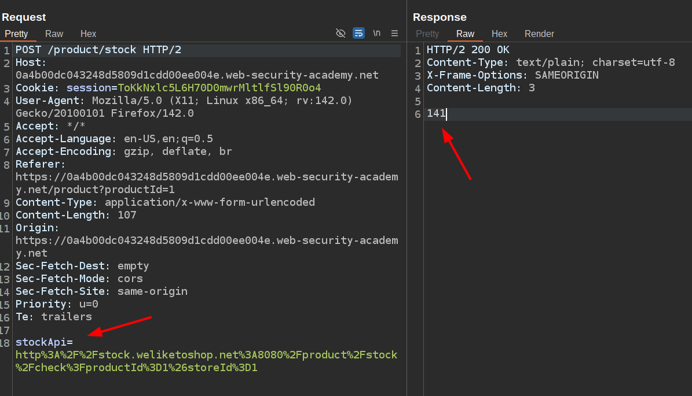

# Portswigger Web Security Academy | SSRF Lab #1

Hi all! Today, we’ll be solving the first SSRF lab from the PortSwigger Web Security Academy. Let’s look at the lab description and get started!

---

### What’s SSRF?

Before diving into the lab, let me briefly explain what SSRF is and how attackers exploit this vulnerability.

SSRF stands for Server-Side Request Forgery. The name is fairly self-explanatory, but let’s break it down for a deeper understanding. Essentially, it’s a vulnerability that allows an attacker to trick the server into making HTTP requests on their behalf—often to internal systems or protected resources that the attacker wouldn’t normally have access to.

Think of an admin dashboard that’s hosted at `localhost:1337/admin`. Since localhost is only accessible from the server itself, a regular user browsing from the internet cannot access this interface directly. This provides a layer of security—only developers or admins who have direct access to the server can view the dashboard.

However, if the application includes a feature that performs an HTTP request to a user-supplied URL (e.g., a stock checker or image fetcher), and if that URL is not properly validated, an attacker may be able to make the server issue a request to localhost. This way, the attacker could potentially access internal-only services and data.

This is the core idea behind SSRF. The attacker doesn’t have access to the internal network, but the server does—so the attacker tricks the application into sending the request on their behalf.

Now, let’s solve the lab.

### Lab Description

In this lab, our goal is to:

1.  Detect the SSRF vulnerability.
2.  Access the contents of the admin dashboard.
3.  Find the feature that allows us to delete users.
4.  Remove the user carlos.

Here’s the HTTP request for the stock check feature, captured using Burp Suite:

The request takes a URL as input. Presumably, this URL is used by the backend to fetch stock data. The response body contains the stock quantity (141), which confirms that the server is using this URL to make the request and return the result.

Now, let’s try to replace the URL with one that points to the internal admin panel and see if we can retrieve data from it.

Success! We’re able to fetch the contents of the admin panel.

Looking at the returned HTML, we can see how users are deleted. It turns out the deletion mechanism is triggered via a simple HTTP GET request (as shown in the screenshot):

The user deletion is performed via anchor (`<a>`) elements that point to a URL like `/admin/delete?username=carlos`. When the server receives this GET request, it deletes the user.

> ⚠️ Note: This isn’t a realistic implementation. In production, user deletions should generally be performed using a DELETE request, with proper authentication and CSRF protection. But for the purpose of demonstrating SSRF, the lab uses a simplified setup.

Let’s go ahead and exploit this. We’ll craft a new URL for the stock checker that points to the user deletion endpoint. We URL-encode the full deletion URL (you can do this with Ctrl+U in Burp Suite), insert it into the stock check request, and send it.

We get a 302 Found response, which usually indicates the request was successfully processed and the client is being redirected. Returning to the lab page, we can now see a message indicating that the lab has been solved.

That’s it for the first lab on SSRF vulnerabilities. Thanks for reading — and have a great day!