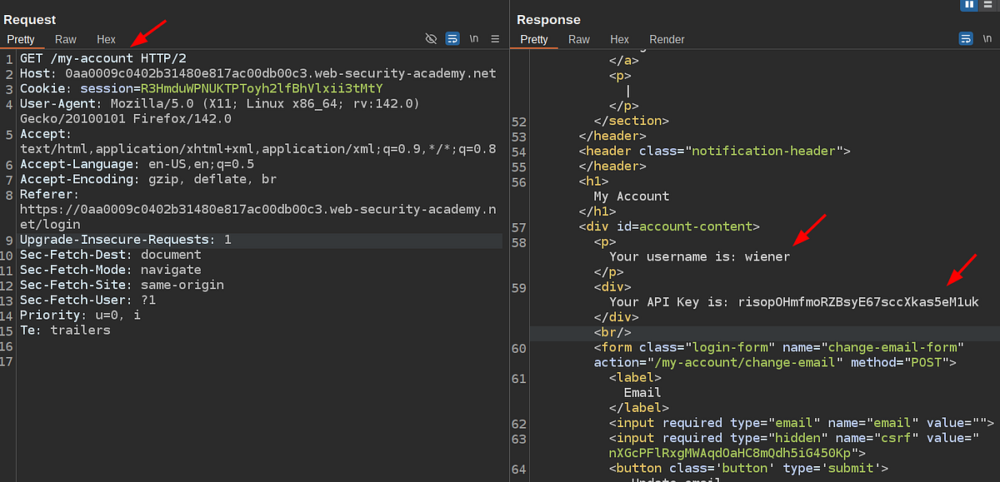
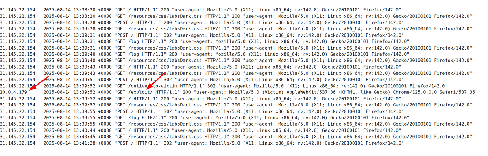

# Portswigger Web Security Academy | Web Cache Deception Lab #1

Hi all! Today, we’ll be solving the first **Web Cache Deception** lab of the PortSwigger Web Security Academy. Let’s get started!

Before we dive into the lab, let’s quickly go over what a **web cache deception vulnerability** is, why it occurs and how attackers exploit it.


The illustration above shows how a web cache behaves in a typical web application. Usually, caches operate based on certain rules — for example, if the URL path ends with a static file extension like `.js`, `.css`, `.png`, `.jpg`, etc., the HTTP response will be cached. This means that future requests for the same resource will not hit the application server, but will instead be served directly from the cache.


**How attackers exploit it:**

1.  **Find a sensitive endpoint** — The attacker locates an endpoint that returns sensitive information, such as API keys, session tokens, or passwords.
2.  **Append a fake static file extension** — They send the same request but append a fake file name with a static extension (e.g., `/my-account/sensitive-data.css`).
3.  **Check the caching behavior** — They look for cache-related headers such as `X-Cache: MISS`. This means the response was not yet in the cache but will be stored for future requests.
4.  **Verify from a different session** — The attacker opens a private/incognito window and makes the same request to see if the cached version — containing sensitive data — can be retrieved without authentication.

If such a vulnerability exists, all the attacker needs to do is craft a malicious link containing the sensitive endpoint with the fake static extension. Once a victim visits that link, the server caches the sensitive response. After that, the attacker can retrieve it directly from the cache.

### Lab Description


First, we need to find an HTTP request that contains a user’s API key.



After logging in as the `wiener` user, I navigated to the **Account** section and found the API key displayed there. Now, let’s try to cache this response.


I noticed that the application caches responses when it detects a static file extension at the end of the path. So, I modified the URL to include a fake file and sent the request again.

The second time I made the request, the response included:

```
X-Cache: hit
```

This confirms that the response was successfully cached. The application is therefore vulnerable to Web Cache Deception.

### Exploiting the Lab

To complete the lab, we need to create a malicious link that will cause the `carlos` user to request the sensitive page, triggering it to be cached. PortSwigger provides an **exploit server** for this purpose.

I added the following HTML to the exploit server:

```html
<html>
    <head>
      <script src="https://<your-lab-subdomain>.web-security-academy.net/my-account/unexisted-from-exploit-server.js"></script>
     </head>
     <body>
        Something went wrong >:)
     </body>
</html>
```

After storing the exploit, I delivered it to the victim.


From the logs, I confirmed that `carlos` visited the exploit page.



Then, I copied the same URL used in the malicious script and opened it in a private window. Since it was cached, I could now access `carlos`’s API key without authentication.


That’s it! After submitting the API key, the lab was completed successfully.