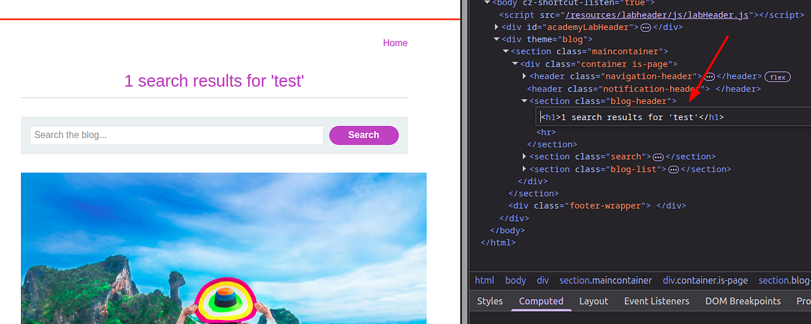

### Portswigger Web Security Academy | XSS Lab #1

Hi everyone! Today, we’ll be solving the first **XSS lab** from the PortSwigger Web Security Academy. Let’s get started!

Before we dive into the lab, let me briefly explain what an **XSS vulnerability** is. XSS stands for **Cross-Site Scripting**, and it allows an attacker to execute arbitrary JavaScript code on a vulnerable web page. If this is your first time hearing about it, you might not think it’s a big deal — but in reality, it’s a serious security issue.

Why? Because JavaScript controls many critical parts of a web application. It can:

* Make API calls
* Access `localStorage` and retrieve potentially sensitive information
* Manipulate the DOM and dynamically create elements

So, when you find a vulnerability that lets you inject **any JavaScript you want** into a page, you essentially gain the same level of access as the legitimate scripts running on that page. That means you can:

* Steal cookies and hijack user accounts
* Display defacements, like printing a flashy **“You’ve been hacked!”** message
* Inject a keylogger to capture keystrokes
* Exfiltrate private chats or sensitive data to your own server

Hopefully, now it’s clear why XSS is such a dangerous vulnerability. Let’s move on to the lab.

#### Lab Description


Here’s how the search functionality works:  
When you enter a query in the search bar, the application makes a **GET request** to a URL like:

```html
/?search=test
```

The search term is then reflected directly in the page’s HTML response.



Let’s try the following XSS payload and see what happens:

```html

```


If an alert box pops up, that’s our **proof of concept** showing that we can run JavaScript on the page thanks to the XSS vulnerability.


When the backend tried to insert our input into the page’s HTML template, it failed to properly escape the input. As a result, the browser interpreted our payload as a valid HTML element instead of plain text. The `onerror` attribute was triggered, and our JavaScript (`alert()`) executed.

Thanks for reading, this is all for this lab. Have a nice day!