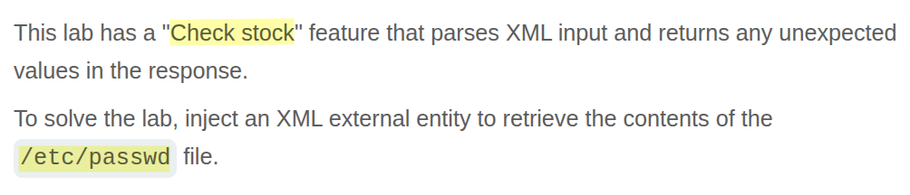
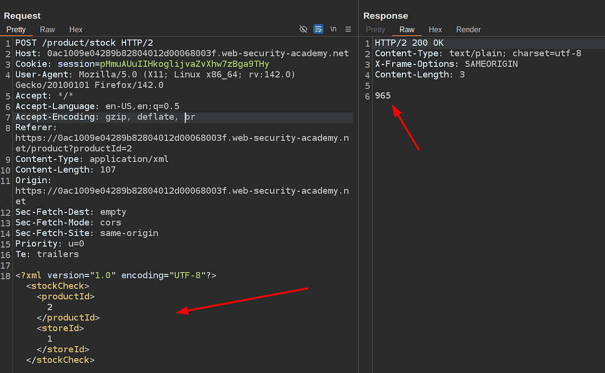
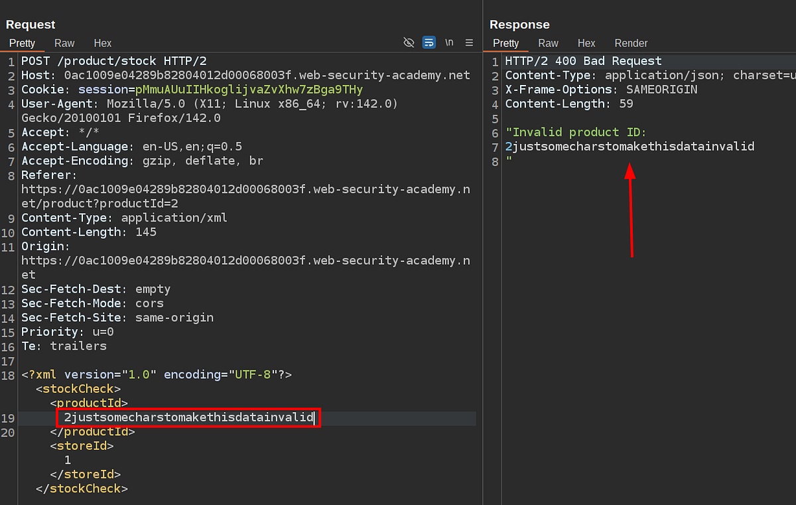
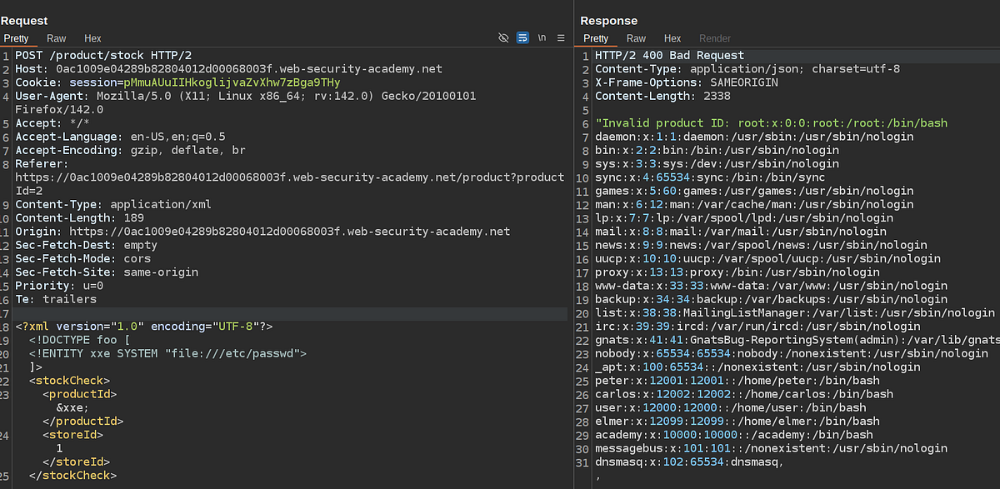

# Portswigger Web Security Academy | XXE Lab #1

Hi all! Today, we’ll be solving the first XXE lab from the PortSwigger Web Security Academy. Let’s start!

---

Before diving into the lab, let me briefly explain what an XXE vulnerability is.

Nowadays, APIs typically use JSON, but that’s not the only option — you can also use XML, HTML, or any format that allows embedding data. XXE (XML External Entity) is a vulnerability that specifically arises when XML is used.

Imagine an XML HTTP request body used to fetch stock data for a particular product, like this:

```xml
<?xml version="1.0" encoding="UTF-8"?>
  <stockCheck>
    <productId>2</productId>
    <storeId>1</storeId>
  </stockCheck>
```

If we converted this to JSON, it would look like:

```json
{
  "productId": 2,
  "storeId": 1
}
```

However, the key difference is that XML supports additional features — like reading from a file and injecting that data into the body — using external entities:

```xml
<?xml version="1.0" encoding="UTF-8"?>
<!DOCTYPE foo [
  <!ENTITY xxe SYSTEM "file:///etc/passwd">
]>
<stockCheck>
  <productId>&xxe;</productId>
  <storeId>1</storeId>
</stockCheck>
```

If the application returns verbose errors in the HTTP response (e.g., “Couldn’t find any stock data for product ID 1”), and includes the output of `&xxe;`, then we can see the contents of the `/etc/passwd` file—which lists available users on the machine.

This is essentially how XXE works. It allows attackers to read unauthorized files, and in some cases, it can even be leveraged for SSRF (Server-Side Request Forgery).

Alright, that’s enough of the explanation — now let’s move on to solving the lab!

#### Lab Description



First, I’ll intercept the stock-fetch request using Burp Suite and show you what it looks like. Hopefully, it’ll look familiar. :)



This is the exact same XML body I used above for the demonstration. Now, let’s see if the application’s “invalid product ID” error returns a verbose message, just like in the earlier example.



Great! Everything works as expected. Now let me show you the payload we’re going to use and walk you through it:

```xml
<?xml version="1.0" encoding="UTF-8"?>
<!DOCTYPE foo [
  <!ENTITY xxe SYSTEM "file:///etc/passwd">
]>
<stockCheck>
  <productId>&xxe;</productId>
  <storeId>1</storeId>
</stockCheck>
```

What we’re doing here is trying to read the contents of `/etc/passwd` and assign that data to a variable called `xxe`. Then, using `&xxe;`, we dereference that variable—effectively inserting its value into the XML body.

Let’s submit this payload and see if we can retrieve the contents of `/etc/passwd`.



That’s all for this lab — nice and easy, yet quite informative if you’ve never encountered an XXE vulnerability before.

Thanks for reading, and have a great day!